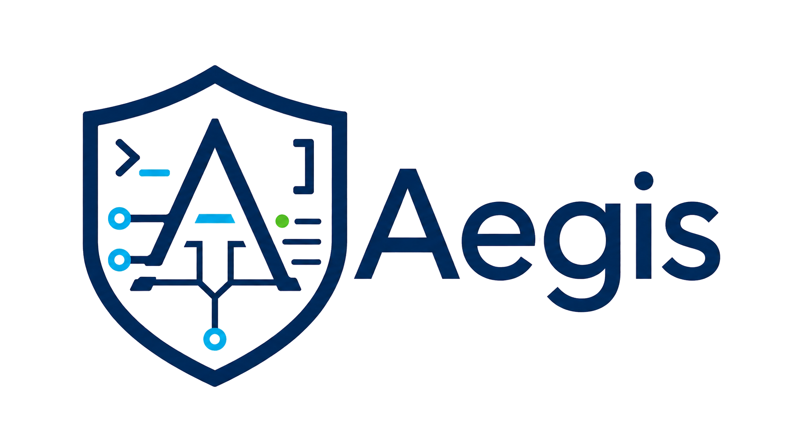
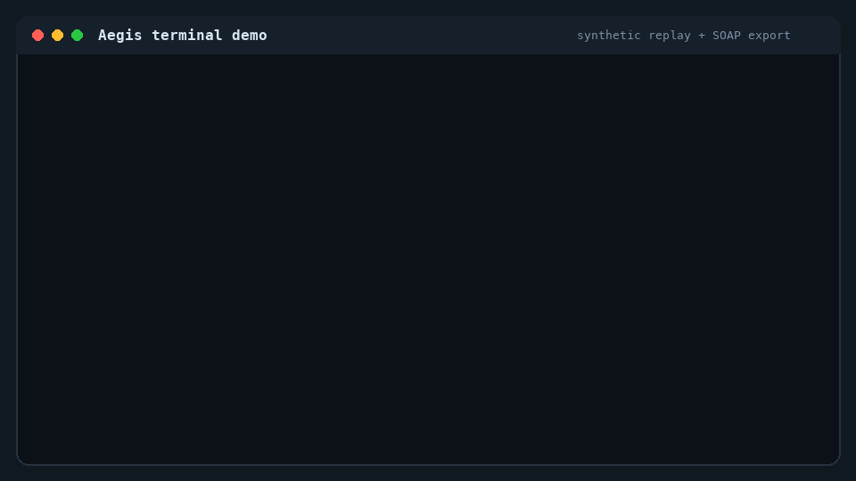
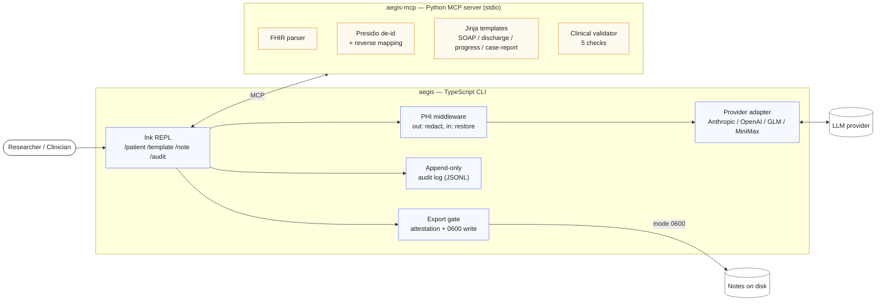
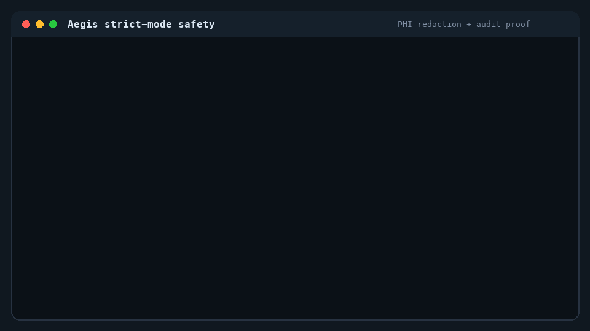

<div align="center">



# Aegis

[](https://github.com/Wu-Junran/aegis/actions/workflows/aegis-ci.yml)
[](LICENSE.md)
[](https://www.npmjs.com/package/aegis-cli)
[](CHANGELOG.md)

**Safe clinical-note drafting from FHIR — with a hard wall between LLM drafts and what gets written to disk.**

<sub>An interactive REPL that loads structured patient data, drafts templated notes, runs clinical validation, redacts PHI, records every round-trip in an append-only audit log, and refuses to export until a reviewer signs off.</sub>

<br/>



<sub>Replay dogfood → REPL session loading a synthetic FHIR bundle, drafting a SOAP note, exporting through the gate at mode 0600.</sub>

</div>

---

> [!WARNING]
> **Aegis is not a medical device.** It is a source-available pre-release research codebase — **not FDA-cleared, not HIPAA-certified, and not for real-time point-of-care use**. Do not use real PHI unless you have completed the strict-mode deployment, provider, data-handling, and reviewer controls described in the [operator guide](docs/operator-guide.md).

## Why Aegis

Drafting clinical notes with an LLM is fast but unsafe by default: PHI leaks into prompts, drafts get saved as records, and there's no audit trail when something goes wrong. Aegis treats those failure modes as load-bearing — every outbound LLM call passes through PHI middleware, every `/note export` crosses a clinician-attestation gate, and every byte that touched a model is recorded in an append-only JSONL log on disk.

- **Three explicit PHI modes** — `strict` / `research` / `off` — that gate de-identification, audit verbosity, and export-attestation language. Mode is selected per process, not per request.
- **Presidio-backed PHI redaction** runs before any outbound LLM call in strict and research mode; reverse-mapping restores plaintext on the response side.
- **Hard export gate** — drafts never become files until a reviewer answers the attestation prompt. Exports land mode `0600`, with `--full` requiring an extra PHI-to-disk confirmation in strict mode.
- **Append-only audit log** at `~/.aegis/audit/<sessionId>.jsonl`, one file per session, fsync'd on every entry. Strict mode stores `redactedPayloadHash` instead of the request body; research mode stores the full plaintext snapshot.
- **Six built-in clinical workflows** — SOAP, discharge summary (PDF), progress note, case report, plus a strict-mode dogfood probe — each backed by a deterministic cassette test.
- **Pluggable LLM provider matrix** — Anthropic native, OpenAI-compatible, GLM, MiniMax, and a generic OpenAI-compatible adapter, with a per-session `.aegisrc` allowlist and OS-keychain credentials via `keytar`.
- **No-spend replay dogfood** exercises six end-to-end workflows against committed cassettes — no API spend, no live LLM call.

## Architecture



The TypeScript half (`aegis/`) owns the REPL, the PHI/audit/export machinery, and provider dispatch. The Python half (`aegis-mcp/`) owns structured-data work — FHIR parsing, Presidio de-id, Jinja template rendering, the 5-check clinical validator. They speak MCP over stdio. See [`aegis/README.md`](aegis/README.md) and [`aegis-mcp/README.md`](aegis-mcp/README.md) for the component-level breakdown.

## Quickstart

Aegis has two halves — a TypeScript CLI and a Python MCP server. The CLI runs without the MCP server, but `/patient load`, de-identification, template rendering, and the validator are no-ops until the venv is set up. Pick the install path that matches what you're trying to do.

### Option A — from source (recommended)

One command, gets you both halves and the smoke tests.

```bash
git clone https://github.com/Wu-Junran/aegis.git
cd aegis
bash aegis/scripts/install.sh
cd aegis && ./dist/aegis --phi-mode research
```

Prerequisites: **Bun ≥ 1.1**, **Python ≥ 3.11**, and an LLM API key for live drafting. The replay demo and cassette tests do not need an API key.

### Option B — via npm (CLI only)

For users who want to evaluate the CLI surface and will set up the Python half separately.

```bash
npm install -g aegis-cli                        # once published, or
npm install -g ./aegis-cli-0.9.0.tgz            # from a local release tarball
aegis --version
```

<details>
<summary>Setting up the Python MCP server alongside the npm CLI</summary>

```bash
# 1. Clone the source repo somewhere persistent — the venv will live inside it.
git clone https://github.com/Wu-Junran/aegis.git /opt/aegis-src

# 2. Build the venv and install the spaCy model Presidio uses for NER.
python3.11 -m venv /opt/aegis-src/aegis-mcp/.venv
/opt/aegis-src/aegis-mcp/.venv/bin/pip install -e '/opt/aegis-src/aegis-mcp[dev]'
/opt/aegis-src/aegis-mcp/.venv/bin/python -m spacy download en_core_web_sm

# 3. Generate the .mcp.json that points the CLI at the venv.
bash /opt/aegis-src/aegis/scripts/generate-mcp-config.sh

# 4. Run.
aegis --phi-mode research
```

Prerequisites: **Node ≥ 20** (npm), **Python ≥ 3.11**, an LLM API key.

</details>

### First REPL session

```text
aegis> /patient load tests/fixtures/synthea_minimal.json
aegis> /template set soap
aegis> Draft a SOAP note for this patient.
aegis> /note export ./notes/visit.md
aegis> /audit show --tail 5
```

Expected: a fenced SOAP draft streams in the REPL, the export prompt asks for a research-use acknowledgment, the file lands mode `0600`, and `/audit show` prints recent `llm_request` / `llm_response` / `note_export_completed` rows.

## No-Spend Demo

The replay demo exercises committed synthetic cassettes and writes temporary exports — no live LLM call, no API spend.

```bash
cd aegis
bun run dogfood:synthea
```

It verifies the validator canary, workflows A through F, export permissions, PDF structure, audit JSONL parsing, and strict-mode audit redaction shape. See [`docs/demo-guide.md`](docs/demo-guide.md) for the full demo script and [`demos/sample-notes/`](demos/sample-notes/) for representative synthetic outputs.

## Safety Model

Aegis treats `phiMode` as the load-bearing safety axis. The user picks the mode at process launch — Aegis cannot inspect a bundle and decide whether it contains real PHI on its own.

| Mode | Intended data | PHI middleware | Audit payload | Export attestation |
|---|---|---|---|---|
| `strict` | Real PHI, after operator controls are in place | redacts before every outbound call | `redactedPayloadHash` only | clinical attestation |
| `research` | Synthetic / de-identified | redacts (defense in depth) | full request snapshot | research-use acknowledgment |
| `off` | Non-medical | bypassed | no LLM round-trip rows | research-use acknowledgment |

<div align="center">



<sub>Strict-mode walkthrough — outbound text replaced with <code>&lt;PERSON_1&gt;</code>/<code>&lt;DATE_1&gt;</code> placeholders, response restored via reverse mapping, audit log carries <code>redactedPayloadHash</code> with <code>fullRequest: false</code>.</sub>

</div>

`off` is process-launch-only (`--phi-mode off --allow-phi-off`) and cannot be entered from inside the REPL. Read [`docs/operator-guide.md`](docs/operator-guide.md) before any non-demo run.

## Development

```bash
cd aegis
bun run check                                   # biome lint + tsc baseline gates
AEGIS_REQUIRE_MCP=1 bun run test:ci             # unit + integration with cassettes
bun run dogfood:synthea                         # no-spend end-to-end

cd ../aegis-mcp
.venv/bin/pytest -q tests/                      # Python MCP tools
```

CI mirrors these on every PR — see [`.github/workflows/aegis-ci.yml`](.github/workflows/aegis-ci.yml). Contribution guidelines and safety rules are in [`CONTRIBUTING.md`](CONTRIBUTING.md).

## Documentation

| Doc | What it covers |
|---|---|
| [`aegis/README.md`](aegis/README.md) | TypeScript CLI internals, workflow table, dev surface |
| [`aegis-mcp/README.md`](aegis-mcp/README.md) | Python MCP server, tool surface, builtin templates |
| [`docs/operator-guide.md`](docs/operator-guide.md) | Install, `.mcp.json` + venv layout, audit schema, providers, PHI modes, `.aegisrc` |
| [`docs/demo-guide.md`](docs/demo-guide.md) | Repeatable no-spend and interactive demos |
| [`demos/`](demos/) | Synthetic sample notes + replay transcript |
| [`CHANGELOG.md`](CHANGELOG.md) | Release notes |
| [`CONTRIBUTING.md`](CONTRIBUTING.md) | Contributor workflow, safety rules, no-PHI policy |
| [`SECURITY.md`](SECURITY.md) | Vulnerability reporting and PHI handling |
| [`CODE_OF_CONDUCT.md`](CODE_OF_CONDUCT.md) | Community expectations |
| [`LICENSE.md`](LICENSE.md) | The Unlicense — public-domain dedication |

## Project Status

Current baseline: **`v0.9.0` pre-release**. The code-side research workflows and replay dogfood are in place. Two release gates remain before any clinical-use claims:

1. **Gate B clinician-workstation dry-run** — Synthea-driven dogfood signed off on a clinician environment.
2. **Clinician-reviewed strict-mode sign-off language** — the export-gate attestation prompt reviewed by a practicing clinician.

Released under [The Unlicense](LICENSE.md) — copy, modify, and redistribute it for any purpose. No warranty.

## Acknowledgements

Aegis is built on top of [yasasbanukaofficial/claude-code](https://github.com/yasasbanukaofficial/claude-code), a public mirror of the Claude Code CLI source. The TypeScript runtime in [`aegis/src/`](aegis/src/) — REPL, command system, MCP host, provider adapters — is derived from that codebase, with an additional medical-safety layer in [`aegis/src/medical/`](aegis/src/medical/) (PHI middleware, de-identification, the export gate, append-only audit log, clinical templates, and the validator). The Python [`aegis-mcp/`](aegis-mcp/) server is original to this project. Thanks to the upstream maintainers for the foundation.
